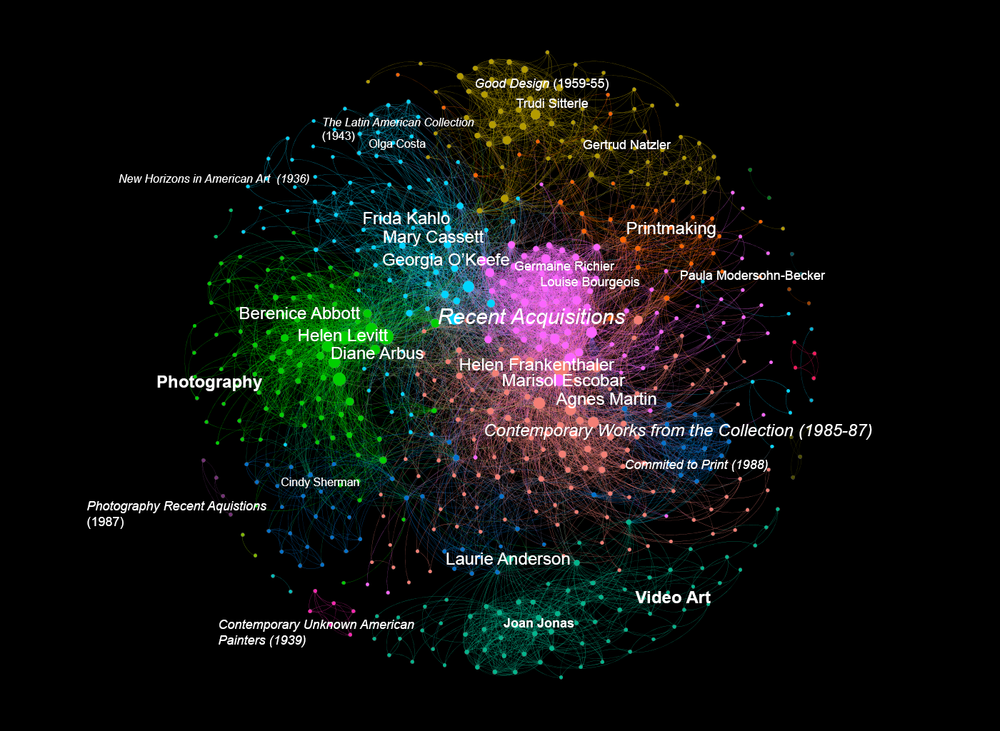

## Network of Female Artists based on MoMA Exhibition Data 

### About 
This project was for a Data Visualization course taken at Pratt Institute and uses exhibition data (1929-1989) from the Museum of Modern Art. Using OpenRefine, the data was cleaned, female artists were identifed, and then colocated. An r script was used to create pairs based on artists that exhibited together. The resulting Gephi visualization illustrates thematic clustering (i.e. photography, video, printmaking) of female artists.

